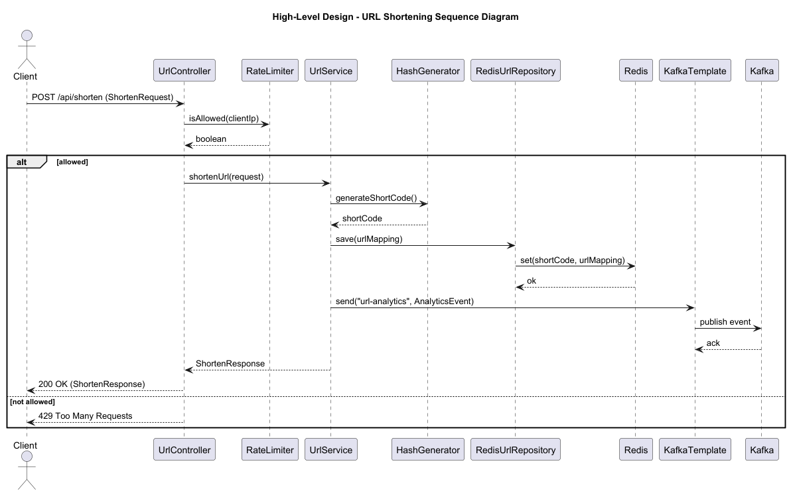
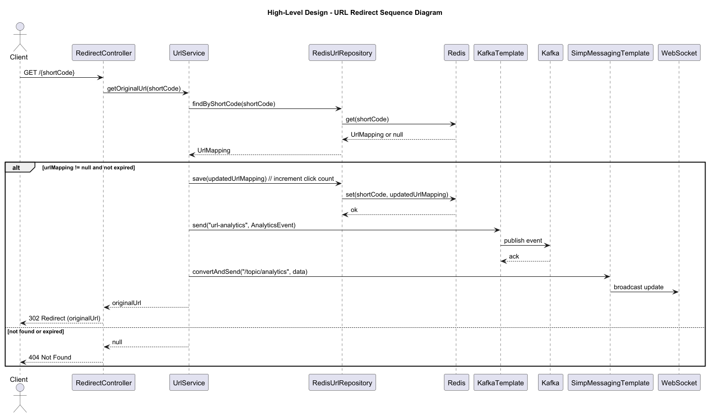

# 🌟 Spring Boot Architecture - Detailed Explanation

> Based on the **URL-Shortener** project, here's a detailed explanation of the Spring Boot architecture implemented,
> structured similarly to the High-Level Design (HLD) and Low-Level Design (LLD) diagrams in the project. I'll break it
> down into layers, components, data flow, and integrations, mirroring the visual diagrams' approach.

## 📋 Table of Contents

- [1. Overall Architecture Overview](#1-overall-architecture-overview)
- [2. Layered Architecture Breakdown](#2-layered-architecture-breakdown)
    - [Presentation Layer (Controllers)](#presentation-layer-controllers)
    - [Service Layer (Business Logic)](#service-layer-business-logic)
    - [Repository Layer (Data Persistence)](#repository-layer-data-persistence)
    - [Configuration Layer](#configuration-layer)
    - [Utility Layer](#utility-layer)
- [3. Data Flow and Sequence Diagrams (Textual Representation)](#3-data-flow-and-sequence-diagrams-textual-representation)
- [4. Integrations and External Systems](#4-integrations-and-external-systems)
- [5. Scalability and Best Practices](#5-scalability-and-best-practices)

## 1. Overall Architecture Overview

The application follows a **layered architecture** typical of Spring Boot microservices:

- **Presentation Layer**: Handles HTTP requests and responses.
- **Service Layer**: Contains business logic.
- **Repository Layer**: Manages data persistence.
- **Configuration Layer**: Defines beans and integrations.
- **Utility Layer**: Provides supporting functions like hashing and rate limiting.

### Key Technologies

- **Spring Boot 3.3.5** with **Java 17**.
- **Redis** for fast, in-memory data storage.
- **Kafka** for asynchronous event streaming (analytics).
- **WebSocket** for real-time updates.
- **Actuator** for monitoring and metrics.
- **ZXing** for QR code generation.

The architecture supports scalability with **Docker** (via `docker-compose.yml`), monitoring (**Prometheus/Grafana**),
and load testing (**JMeter**).

## 2. Layered Architecture Breakdown

### Presentation Layer (Controllers)

#### Components

- **`UrlController`**: REST endpoints for shortening URLs (`/api/shorten`), bulk shortening (`/api/shorten/bulk`),
  analytics (`/api/analytics/{shortCode}`), and QR code generation (`/api/qr/{shortCode}`).
- **`RedirectController`**: Handles URL redirection (`/{shortCode}`) using `RedirectView`.

#### Features

- Rate limiting via `RateLimiter` utility to prevent abuse.
- Input validation and error handling (e.g., 400 for invalid requests, 404 for non-existent codes).
- CORS and security can be added via Spring Security (not implemented yet).

#### Data Flow

Receives JSON requests, delegates to service layer, returns JSON responses or binary (QR codes).

### Service Layer (Business Logic)

#### Components

- **`UrlService`** (interface) and **`UrlServiceImpl`** (implementation).

#### Responsibilities

- **URL shortening**: Generates short codes (via `HashGenerator`), stores mappings, handles TTL (time-to-live) for
  expiration.
- **Redirection**: Retrieves original URL, increments click count, checks expiration.
- **Analytics**: Tracks click counts, sends events to Kafka.
- **Bulk operations**: Processes multiple URLs in a single request.

#### Integrations

- **Kafka**: Publishes `AnalyticsEvent` messages (e.g., "shorten" or "click" events) to "url-analytics" topic for
  downstream processing.
- **WebSocket**: Sends real-time updates to `/topic/analytics` for live dashboards.
- **Metrics**: Uses Micrometer to increment counters (`url_shortened_total`, `url_clicked_total`) exposed via Actuator.
- **Caching**: `@EnableCaching` on `Application.java` for potential performance boosts (e.g., caching short code
  lookups).

#### Data Flow

Orchestrates repository operations, applies business rules, triggers events.

### Repository Layer (Data Persistence)

#### Components

- **`RedisUrlRepository`**: Uses `RedisTemplate` for CRUD operations on `UrlMapping` objects.

#### Features

- Key-value storage: Short code as key, `UrlMapping` (JSON-serialized) as value.
- Operations: Save, find by short code, check existence.
- No SQL database; Redis provides high-speed access suitable for URL shorteners.

#### Configuration

`RedisConfig` sets up `RedisTemplate` with Jackson serialization for complex objects.

#### Data Flow

Stores/retrieves `UrlMapping` entities (`id`, `shortCode`, `originalUrl`, `createdAt`, `expiresAt`, `clickCount`).

### Configuration Layer

#### Components

- **`RedisConfig`**: Bean for `RedisTemplate`.
- **`WebSocketConfig`**: Enables STOMP messaging with SockJS fallback for browser compatibility.

#### Features

- Profiles: Default (localhost) and "docker" (containerized services).
- Actuator endpoints exposed in docker profile for monitoring.

### Utility Layer

#### Components

- **`HashGenerator`**: Generates unique short codes using Base62 encoding and an atomic counter (simple,
  collision-resistant).
- **`RateLimiter`**: Basic in-memory rate limiting (can be enhanced with Redis for distributed setups).

#### Features

- Hashing: Incremental IDs encoded to short strings (e.g., "1" -> "1", "62" -> "10").
- Rate Limiting: Tracks requests per IP; configurable thresholds.

## 3. Data Flow and Sequence Diagrams (Textual Representation)

### URL Shortening Flow (Similar to HLD_URL_Shortening.png)

1. Client sends `POST /api/shorten` with `ShortenRequest` (`originalUrl`, optional `customShortCode`, `ttlSeconds`).
2. `UrlController` checks rate limit via `RateLimiter`.
3. Delegates to `UrlServiceImpl.shortenUrl()`.
4. Generates short code (custom or auto via `HashGenerator`).
5. Checks uniqueness in Redis.
6. Creates `UrlMapping`, saves to `RedisUrlRepository`.
7. Publishes "shorten" event to Kafka.
8. Increments metrics counter.
9. Returns `ShortenResponse` with `shortUrl`.

### URL Redirection Flow (Similar to HLD_URL_Redirect.png)

1. Client accesses `GET /{shortCode}`.
2. `RedirectController` calls `UrlServiceImpl.getOriginalUrl()`.
3. Retrieves `UrlMapping` from Redis.
4. Checks expiration; if expired, returns null (404).
5. Increments click count, saves back to Redis.
6. Sends real-time update via WebSocket to `/topic/analytics`.
7. Publishes "click" event to Kafka.
8. Increments metrics counter.
9. Returns `RedirectView` to original URL.

### Analytics and Real-Time Updates

- Kafka consumers (external) process events for reporting.
- WebSocket clients subscribe to `/topic/analytics` for live click counts.
- Actuator exposes metrics at `/actuator/metrics`.

## 4. Integrations and External Systems

| System           | Purpose                                                            | Configuration                           |
|------------------|--------------------------------------------------------------------|-----------------------------------------|
| **Redis**        | Primary datastore                                                  | `application.yml` (localhost or docker) |
| **Kafka**        | Event streaming                                                    | Producers in service layer              |
| **WebSocket**    | Real-time push                                                     | STOMP broker                            |
| **Monitoring**   | Actuator endpoints; Prometheus scrapes metrics; Grafana visualizes | Docker profile                          |
| **Docker**       | Orchestrates app, Redis, Kafka, Zookeeper, Prometheus, Grafana     | `docker-compose.yml`                    |
| **Load Testing** | Performance validation                                             | JMeter scripts in `tests/load/`         |

## 5. Scalability and Best Practices

- **Horizontal Scaling**: Stateless app; Redis/Kafka handle distributed state/events.
- **Caching**: Enabled; can cache frequent lookups.
- **Security**: Basic rate limiting; add OAuth/JWT for production.
- **Error Handling**: Exceptions caught in controllers; custom error responses.
- **Testing**: Unit tests with Mockito; integration tests with Testcontainers (Redis/Kafka).
- **CI/CD**: Maven build; Qodana for code quality; JaCoCo for coverage.

